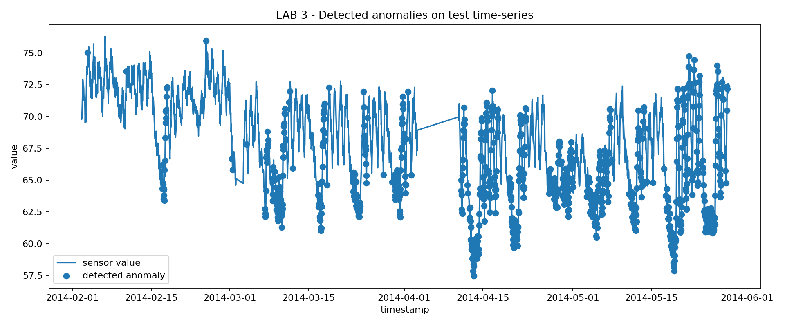
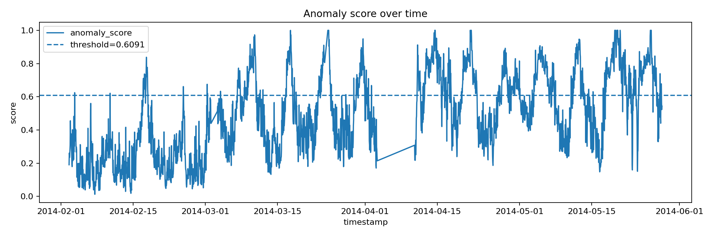
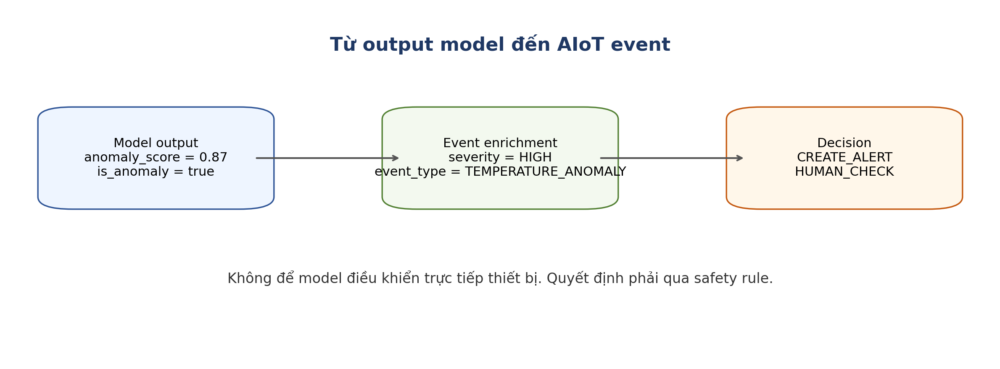

# Lab3 — AIoT Anomaly Detection & Event Intelligence

> Bài thực hành triển khai AI cho dữ liệu IoT dạng chuỗi thời gian.  
> Mục tiêu chính: phát hiện bất thường từ telemetry sensor, chuyển kết quả model thành event cảnh báo và triển khai API bằng FastAPI.

---

## 1. Bài này làm về gì?

Lab3 không xử lý ảnh như YOLO hay Computer Vision. Bài này làm với **dữ liệu cảm biến IoT theo thời gian**.

Luồng xử lý tổng quát:

```text
Telemetry sensor data
→ clean data
→ feature engineering theo time window
→ anomaly detection model
→ anomaly_score
→ threshold
→ event_type
→ severity
→ decision
→ anomaly_event_log.csv
→ FastAPI /detect-anomaly
```

Nói ngắn gọn: hệ thống học cách nhận biết dữ liệu bình thường, sau đó đánh dấu các điểm bất thường và tạo cảnh báo phù hợp.

---

## 2. Dataset sử dụng

Dataset chính:

```text
data/ambient_temperature_system_failure.csv
```

Đây là dữ liệu nhiệt độ môi trường theo thời gian. Bài lab dùng dữ liệu này để mô phỏng cảm biến IoT trong hệ thống giám sát nhiệt độ.

Một bản có label cũng được cung cấp để đánh giá model:

```text
data/ambient_temperature_system_failure_labeled.csv
```

---

## 3. Model sử dụng

Project có hai hướng model:

| Model | Vai trò |
|---|---|
| Isolation Forest | Model chính để phát hiện bất thường trong chuỗi thời gian IoT |
| MLP Autoencoder demo | Mô hình phụ để so sánh cách phát hiện bất thường bằng reconstruction error |

Model chính đã được lưu trong:

```text
models/anomaly_model_bundle_iforest_v2.joblib
```

---

## 4. Output quan trọng

Khác với bài Computer Vision trả về `bbox`, `class`, `confidence`, bài Lab3 trả về các output dạng event:

| Output | Ý nghĩa |
|---|---|
| `anomaly_score` | Điểm bất thường của telemetry |
| `threshold_used` | Ngưỡng dùng để quyết định bất thường |
| `is_anomaly` | Dữ liệu có bất thường hay không |
| `event_type` | Loại sự kiện, ví dụ `NORMAL_TELEMETRY` hoặc `ANOMALY_DETECTED` |
| `severity` | Mức độ nghiêm trọng của sự kiện |
| `decision` | Hành động đề xuất, ví dụ `NO_ALERT`, `SEND_ALERT`, `CHECK_SENSOR` |
| `anomaly_event_log.csv` | File log các sự kiện bất thường |

---

## 5. Kết quả minh chứng

### Biểu đồ phát hiện bất thường

<p align="center">
  
</p>

### Biểu đồ anomaly score theo thời gian

<p align="center">
  
</p>

### Pipeline từ model output sang event

<p align="center">
  
</p>

---

## 6. Cấu trúc thư mục

```text
Lab3/
├── data/                         # Dataset telemetry IoT
├── diagrams/                     # Sơ đồ pipeline và event flow
├── figures/                      # Biểu đồ kết quả
├── models/                       # Model đã train .joblib
├── notebooks/                    # Notebook chạy từng bước
├── outputs/                      # Metrics, prediction, event log, API test result
├── src/
│   ├── app.py                    # FastAPI deploy model
│   ├── download_data.py          # Tải dữ liệu hoặc dùng fallback data
│   ├── plot_results.py           # Vẽ biểu đồ kết quả
│   ├── test_api.py               # Test API khi server đang chạy
│   ├── test_api_local.py         # Test logic API không cần mở port
│   ├── train_anomaly.py          # Train/test Isolation Forest + Autoencoder demo
│   └── utils.py                  # Hàm xử lý dữ liệu, feature, event mapping
├── requirements.txt
├── .gitignore
└── README.md
```

---

## 7. Cài đặt môi trường

### macOS / Linux

```bash
python3 -m venv .venv
source .venv/bin/activate
python -m pip install --upgrade pip
pip install -r requirements.txt
```

### Windows

```bash
python -m venv .venv
.venv\Scripts\activate
python -m pip install --upgrade pip
pip install -r requirements.txt
```

---

## 8. Chạy toàn bộ bài lab

### Bước 1: Tải hoặc chuẩn bị dữ liệu

```bash
python src/download_data.py
```

### Bước 2: Train và đánh giá model

```bash
python src/train_anomaly.py
```

Sau bước này, các file kết quả sẽ được tạo trong `models/` và `outputs/`.

### Bước 3: Vẽ biểu đồ

```bash
python src/plot_results.py
```

Kết quả sẽ nằm trong:

```text
figures/anomaly_detection_result.png
figures/anomaly_score_over_time.png
```

---

## 9. Chạy API deploy model

Chạy FastAPI server:

```bash
uvicorn src.app:app --reload
```

Mở Swagger UI:

```text
http://127.0.0.1:8000/docs
```

Test API ở terminal khác:

```bash
python src/test_api.py
```

Nếu không muốn mở server, có thể test local logic:

```bash
python src/test_api_local.py
```

---

## 10. API chính

### Health check

```text
GET /health
```

Kết quả mong đợi:

```json
{
  "status": "ok",
  "model_loaded": true
}
```

### Detect anomaly

```text
POST /detect-anomaly
```

Kết quả API gồm ba phần chính:

```json
{
  "model_output": {
    "anomaly_score": 0.5434,
    "threshold_used": 0.6091,
    "is_anomaly": false,
    "model_version": "iforest_v2"
  },
  "event": {
    "event_type": "NORMAL_TELEMETRY",
    "severity": "LOW",
    "decision": "NO_ALERT"
  },
  "api_check": {
    "latency_ms": 53.54,
    "input_points": 40
  }
}
```

---

## 11. Kết quả đã có trong project

Các file kết quả quan trọng:

```text
models/anomaly_model_bundle_iforest_v2.joblib
models/isolation_forest_iforest_v1.joblib
models/mlp_autoencoder_demo.joblib
outputs/iforest_metrics.json
outputs/autoencoder_metrics.json
outputs/iforest_test_predictions.csv
outputs/autoencoder_test_predictions.csv
outputs/anomaly_event_log.csv
outputs/api_test_result.json
figures/anomaly_detection_result.png
figures/anomaly_score_over_time.png
```

Một số metric của Isolation Forest:

| Metric | Giá trị |
|---|---:|
| Precision | 0.2401 |
| Recall | 0.5675 |
| F1-score | 0.3374 |
| Threshold | 0.6091 |
| Train rows | 4723 |
| Test rows | 2544 |

Lưu ý: với anomaly detection, precision/recall/F1 chỉ có ý nghĩa khi có label anomaly để đánh giá.

---

## 12. Nội dung cần hiểu sau bài lab

Sau khi hoàn thành Lab3, cần giải thích được:

- Anomaly detection khác classification thông thường ở điểm nào.
- Vì sao cần tạo feature theo cửa sổ thời gian.
- `anomaly_score` là gì.
- Vì sao `anomaly_score` chưa phải quyết định cuối cùng.
- Threshold ảnh hưởng thế nào đến số lượng cảnh báo.
- Vì sao cần chuyển model output thành `event_type`, `severity`, `decision`.
- Test model khác deploy model như thế nào.
- Vì sao hệ thống AIoT không nên tự động điều khiển actuator chỉ dựa vào một điểm anomaly score.

---

## 13. Checklist nộp bài

- [x] Chạy được notebook hoặc script train model.
- [x] Có model `.joblib` trong thư mục `models/`.
- [x] Có metrics JSON trong `outputs/`.
- [x] Có prediction CSV trong `outputs/`.
- [x] Có `anomaly_event_log.csv`.
- [x] Có ít nhất 2 biểu đồ trong `figures/`.
- [x] Deploy được FastAPI.
- [x] Test được API `/health` và `/detect-anomaly`.
- [x] Giải thích được output model và event intelligence.

---

## 14. Ghi chú khi upload GitHub

Không upload môi trường ảo Python:

```text
.venv/
venv/
env/
```

File `.gitignore` trong project đã loại trừ sẵn các thư mục cache và môi trường ảo.  
Các file `models/`, `outputs/`, `figures/` trong bài này có dung lượng nhỏ nên có thể giữ lại để làm minh chứng kết quả.

---

## 15. Lệnh chạy nhanh

```bash
source .venv/bin/activate
python src/train_anomaly.py
python src/plot_results.py
uvicorn src.app:app --reload
```

Mở API docs:

```text
http://127.0.0.1:8000/docs
```
